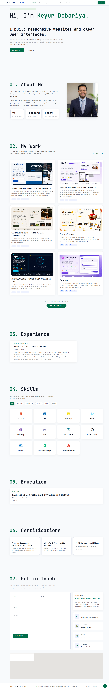

# 💼 Keyur Dobariya — Developer Portfolio


A modern and fully responsive personal portfolio website built using HTML, CSS, and JavaScript.

This portfolio showcases my frontend development projects, skills, internship experience, and contact information with smooth animations and a clean user interface.

---

## 🚀 Live Demo

🔗 Live Website: https://kd-dev-alt.github.io/Keyur-s-Portfolio/

---

## 📸 Project Preview



---

## 📱 Mobile Preview


---

## ✨ Features

- Modern & Professional Portfolio Design
- Fully Responsive Across All Devices
- Dynamic Typing Animation
- Scroll-Based Active Navigation
- Smooth Section Reveal Animations
- Project Showcase & Archive Page
- Skills Filtering System
- Internship Experience Timeline
- Education & Certification Showcase
- Resume Download Functionality
- Interactive Contact Form
- Google Maps Integration
- Social & Professional Profile Links
- Mobile-Friendly Navigation Menu
- Scroll To Top Button
- Optimized Performance & Clean Code Structure

---

## 🛠️ Technologies Used

| Technology | Usage |
|------------|-------|
| HTML5 | Structure |
| CSS3 | Styling & Responsive Design |
| JavaScript | Interactivity & Animations |
| Font Awesome | Icons |

---

## 📂 Folder Structure

```bash
Keyur-s-Portfolio/
│
├── index.html
│
├── css/
│   └── style.css
│
├── js/
│   ├── script.js
│   └── projects.js
│
├── assets/
│   │
│   ├── images/
│   │   ├── desktop-preview.png
│   │   ├── mobile-preview.png
│   │   ├── foodiepizza.png
│   │   ├── Landing-Page.png
│   │   ├── digital-clock.png
│   │   ├── product-card.png
│   │   ├── quiz-app.png
│   │   ├── responsive-webpage.png
│   │   ├── todo-list-app.png
│   │   ├── nayepankh-foundation.png
│   │   ├── she-can-foundation.png
│   │   └── keyur.png
│   │
│   ├── icons/
│   │   └── Favicon.png
│   │
│   └── resume/
│       └── Keyur_Dobariya_Resume.pdf
│
└── README.md
```

---
## 📌 Featured Projects

### 🌍 NayePankh Foundation — NGO Website

A responsive multi-page NGO website featuring dark mode, impact counters, volunteer application forms, FAQ section, contact page, and modern UI.

**Tech Stack:** HTML, CSS, JavaScript  
**Live Demo:** https://kd-dev-alt.github.io/NayePankh-Foundation/  
**GitHub:** https://github.com/KD-dev-alt/NayePankh-Foundation

---

### 💜 She Can Foundation — NGO Website

A modern NGO website focused on women empowerment featuring dark mode, interactive UI, animations, toast notifications, and smooth user experience.

**Tech Stack:** HTML, CSS, JavaScript  
**Live Demo:** https://kd-dev-alt.github.io/She-Can-Foundation/  
**GitHub:** https://github.com/KD-dev-alt/She-Can-Foundation

---

### 🍕 FoodiePizza App
A responsive pizza ordering website with a clean UI, interactive food cards, categorized menu sections, and mobile-friendly layout.

**Tech Stack:** HTML, CSS, JavaScript  
**Live Demo:** https://kd-dev-alt.github.io/FoodiePizza-Website/  
**GitHub:** https://github.com/KD-dev-alt/FoodiePizza-Website

---

### 🧠 Quiz App
An interactive quiz application with multiple-choice questions, timer functionality, score tracking, and answer validation.

**Tech Stack:** HTML, CSS, JavaScript  
**Live Demo:** https://kd-dev-alt.github.io/Quiz-App/  
**GitHub:** https://github.com/KD-dev-alt/Quiz-App

---

### 📝 To-Do List App
A simple task manager app with add, edit, delete, complete, and filter task functionality.

**Tech Stack:** HTML, CSS, JavaScript  
**Live Demo:** https://kd-dev-alt.github.io/To-Do-List-App/  
**GitHub:** https://github.com/KD-dev-alt/To-Do-List-App

---

### ☕ Ceremony Brews
A premium café landing page with elegant design, responsive layout, and smooth user experience.

**Tech Stack:** HTML, CSS, JavaScript  
**Live Demo:** https://kd-dev-alt.github.io/Ceremony-Brews-Landing-Page/  
**GitHub:** https://github.com/KD-dev-alt/Ceremony-Brews-Landing-Page

---

### 📊 Responsive WebPage
A modern enterprise dashboard UI with sidebar navigation, analytics cards, timeline section, and responsive layout.

**Tech Stack:** HTML, CSS  
**Live Demo:** https://kd-dev-alt.github.io/Responsive-WebPage/  
**GitHub:** https://github.com/KD-dev-alt/Responsive-WebPage

---

### 🛍️ Product Card UI
A modern e-commerce product card interface with hover effects, pricing, ratings, and responsive design.

**Tech Stack:** HTML, CSS  
**Live Demo:** https://kd-dev-alt.github.io/Product-Card/  
**GitHub:** https://github.com/KD-dev-alt/Product-Card

---

### ⏰ Digital Clock — Analog & Digital Time App
A modern clock application featuring analog and digital time display, live date, smooth animations, and dark-themed responsive UI.

**Tech Stack:** HTML, CSS, JavaScript  
**Live Demo:** https://kd-dev-alt.github.io/Modern-Analog-Digital-Clock/  
**GitHub:** https://github.com/KD-dev-alt/Modern-Analog-Digital-Clock

---

# 📄 License

This project is open source and available under the MIT License.

---

# 👨‍💻 Author

**Keyur Dobariya**

Frontend & Web Developer 

- Portfolio: https://kd-dev-alt.github.io/Keyur-s-Portfolio/
- GitHub: https://github.com/KD-dev-alt
- LinkedIn: https://www.linkedin.com/in/keyur-dobariya-dev
- Email: keyur.dobariya.dev@gmail.com

---

⭐ If you like this project, feel free to star the repository and connect with me on LinkedIn!